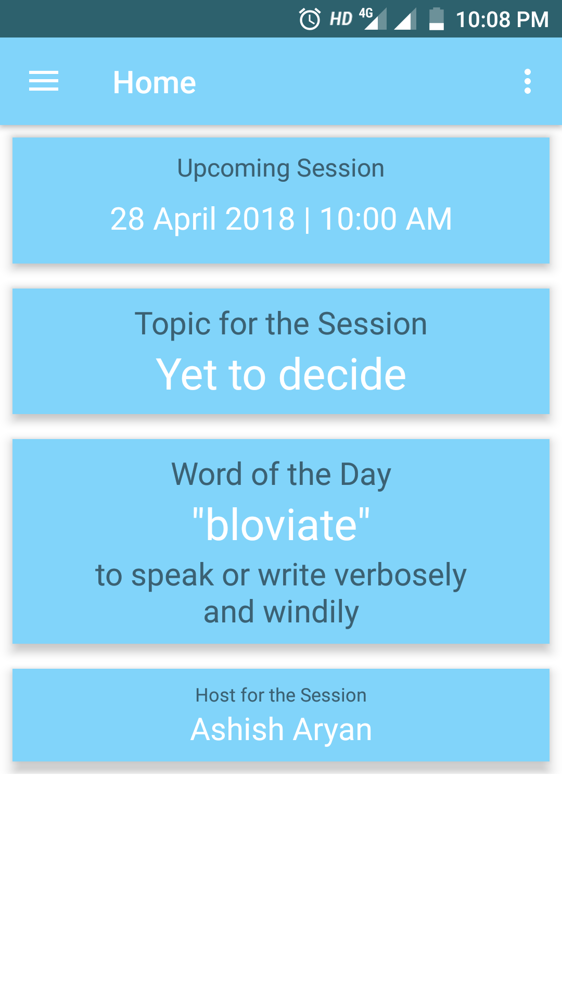
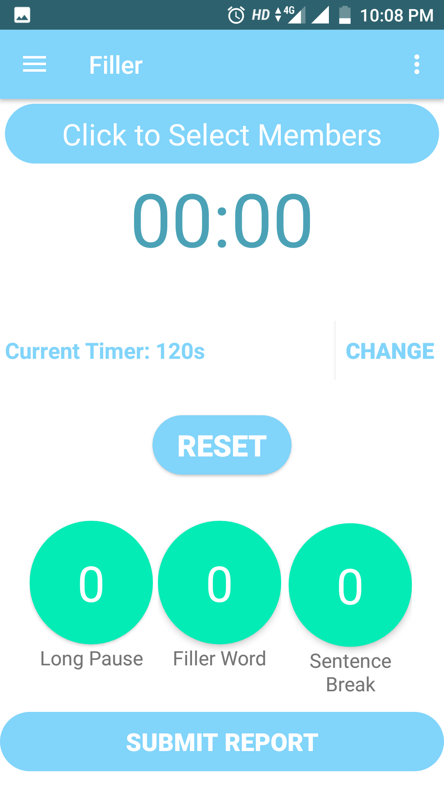

<h1 style="color:#00FF00;">Orator</h1>
App uses Firebase as the authentication server and Firebase Realtime database as the connectivity.
Contributer are invited coridially to improve this project.
<h3 align="center">
  Below are the screenshot of the App.
  </h3>

  
  

  
  

  

